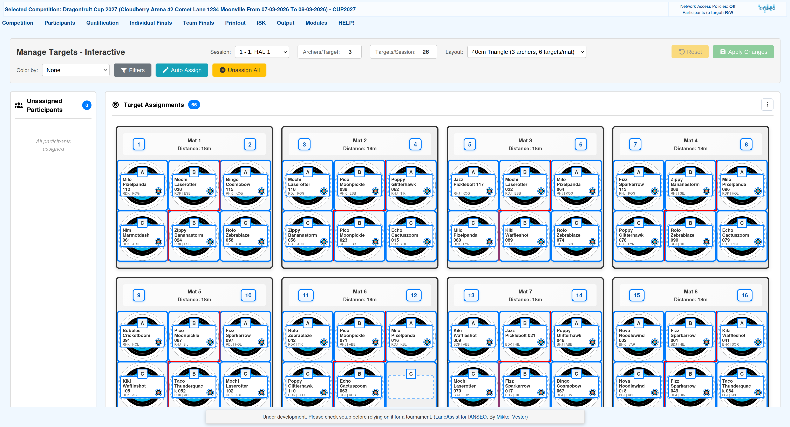
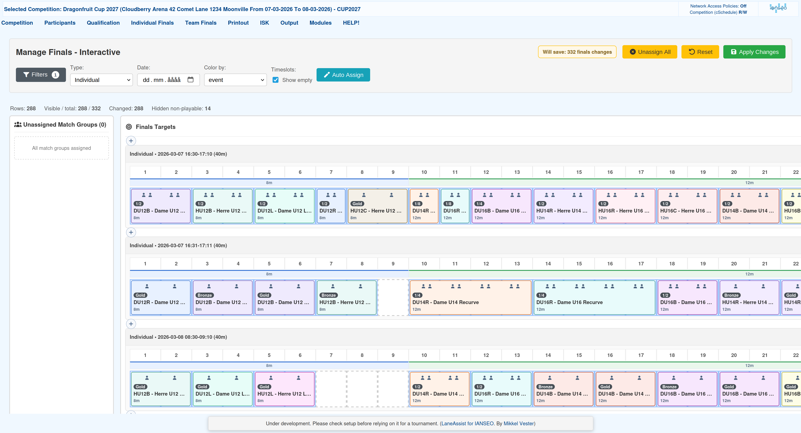
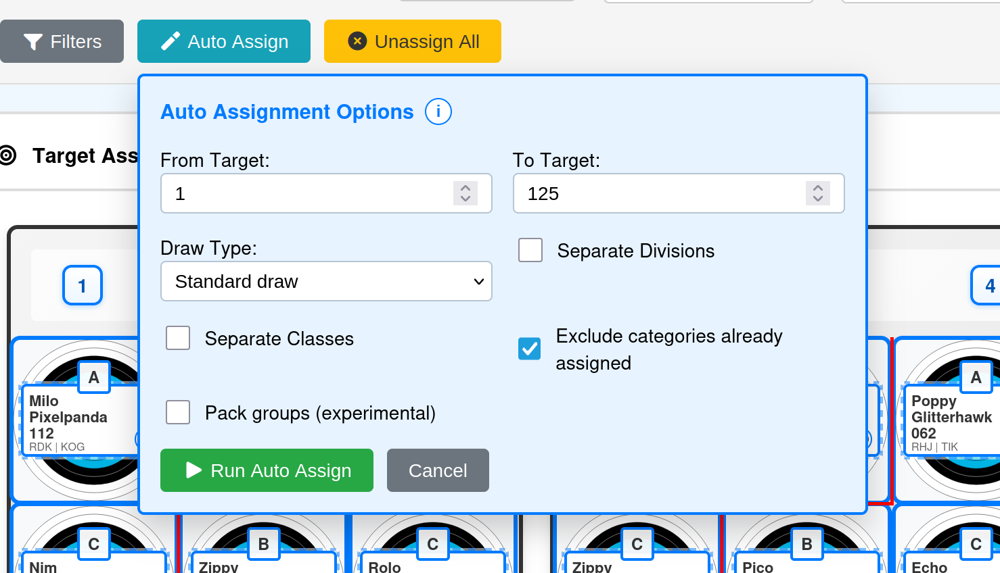
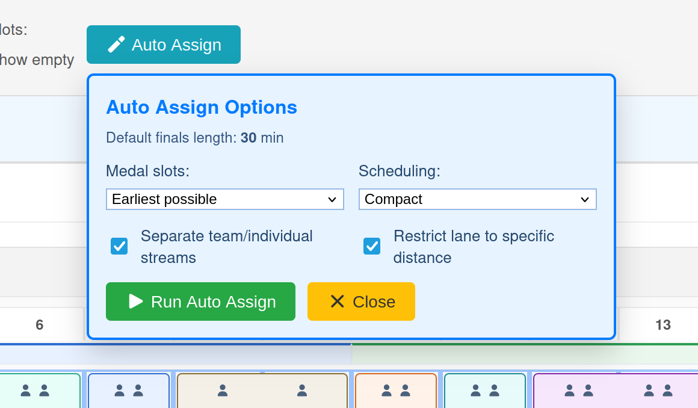
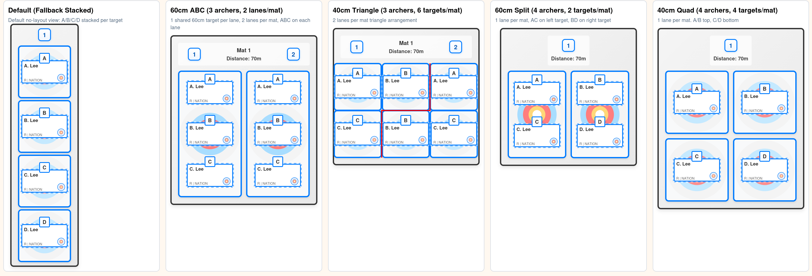
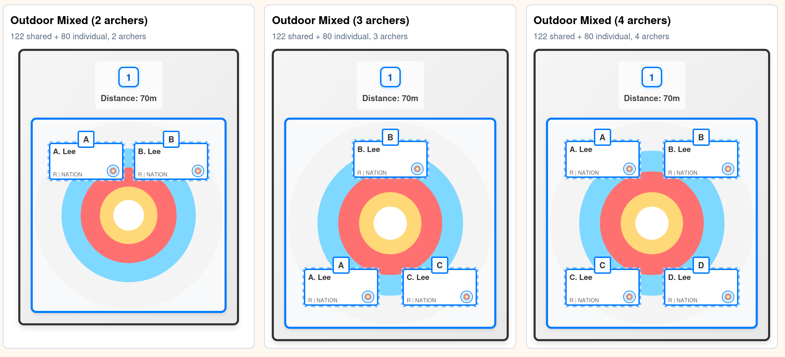
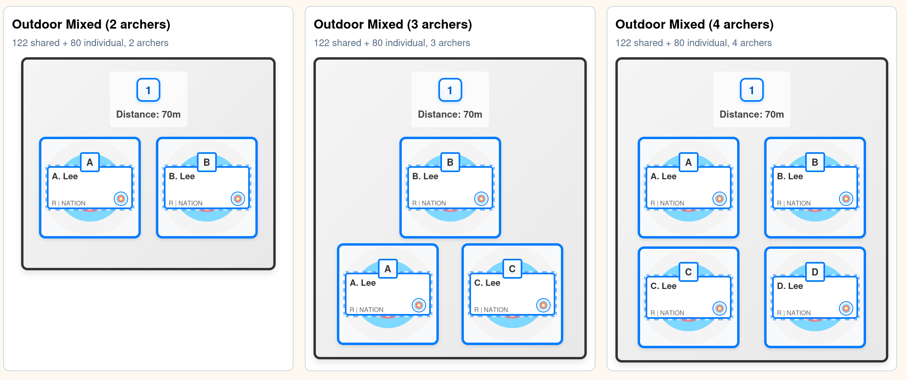

# LaneAssist Module for IANSEO

LaneAssist is a custom IANSEO module focused on faster, easier tournament operations for field-side workflows.

## Screenshots

## What It Adds

LaneAssist adds practical tools on top of IANSEO, including:

- Interactive target management (Drag & drop + auto)
- Interactive finals management (Drag & drop + auto)
- Tournament cloning helpers
- Module settings and update controls
- Shared UI assets used across LaneAssist pages

## Requirements

- A working IANSEO installation
- File access to your IANSEO folder
- Permission to replace files in `Modules/Custom/`

## Install (Recommended)

1. Download the latest **release asset** from GitHub Releases:
   - `laneassist-module-vX.Y.zip`
   - Do not use the automatic `Source code (zip)` archive.
2. Open your IANSEO folder.
3. Go to `Modules/Custom/`.
4. Delete or rename old `LaneAssist` folder if it exists.
5. Extract the release zip so the final path is exactly:
   `Modules/Custom/LaneAssist`
   - You do not need to create the `LaneAssist` folder manually.
   - The release zip already includes the `Modules/Custom/LaneAssist` folder path.
6. Open IANSEO in your browser.
7. Check that these entries are visible under Modules: (Some only when a tournament has been selected)
   - Clone Tournament
   - Manage Targets - Interactive
   - Manage Finals - Interactive
   - LaneAssist Settings

## Update

1. Download the newest `laneassist-module-vX.Y.zip` from Releases.
2. Replace `Modules/Custom/LaneAssist` with the new files.
3. Reload IANSEO and test:
   - Manage Targets
   - Manage Finals
   - Clone Tournament
   - Settings page

## License

Check your IANSEO deployment policies and upstream licensing terms before publishing publicly.
